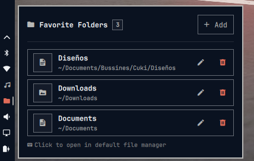

# Omarchy Favorite Folders

A native **Omarchy** (Hyprland + Quickshell) bar widget and popup card for quickly accessing, managing, and opening your favorite folder shortcuts in your default file manager (`xdg-open`).

<p align="center">
  
</p>

---

## Installation

### Option 1:

```bash
omarchy plugin add https://github.com/MrDemonc/omarchy-favorite-folders.git --enable
omarchy restart shell
```

### Option 2:

```bash
git clone https://github.com/MrDemonc/omarchy-favorite-folders.git
cd omarchy-favorite-folders
./install.sh --enable --restart
```

---

## ✨ Features / Características

- 📁 **Bar Widget Icon**:
  - Clean folder icon (`󰉋`) in the Omarchy bar.
  - Active indicator when popup is open.
  - Live tooltip showing total configured shortcuts.

- ➕ **Add Folder Shortcuts (+)**:
  - Add any directory path (e.g., `/home/demonc/Documents/Proyects/omarchy-media-control` or `~/Downloads`).
  - **Auto-detection**: Automatically extracts a clean display name from the folder path if left empty.
  - **Visual Folder Picker**: Built-in **Browse...** (`󰉓`) button powered by Zenity for graphical folder selection.
  - **Quick Preset Chips**: Fast one-click shortcuts for `Home`, `Documents`, `Downloads`, `Projects`, and `Pictures`.

- 👻 **Missing Folder Detection:**:
  - If0 an added folder is deleted or moved within the system, the widget automatically detects it and displays a ghost icon (**`󰊠`**) along with the **`missing`** label in an alert color.
  - Clicking on a broken shortcut notifies the user instead of silently failing, allowing them to edit the path or delete the shortcut.

- 🚀 **Default File Manager Integration**:
  - Clicking any folder item launches your system's default file explorer (Nautilus, Dolphin, Thunar, etc.) instantly via `xdg-open`.

- 󰏫 **Edit Shortcuts**:
  - Easily update existing folder paths and custom alias names.

- 󰩹 **Safe Deletion**:
  - Remove shortcuts with a clear confirmation dialog to prevent accidental removals.

- 💾 **Persistent Configuration**:
  - Automatically saves and loads your folder shortcuts in `~/.config/omarchy/favorite-folders.json`.

- ⌨️ **Keyboard Accessibility**:
  - Press <kbd>Esc</kbd> to exit forms or close the popup modal.
  - Press <kbd>Enter</kbd> to quickly save folder forms.

---

## 🎛️ Interaction Cheatsheet

| Action | Control / Gesture |
| :--- | :--- |
| **Open / Close popup** | Left click on the bar icon (`󰉋`) |
| **Close popup** | Press <kbd>Esc</kbd> or click outside the popup |
| **Open Folder** | Left click on any folder item in the list |
| **Add Folder** | Click `+ Add` button in the header or empty state |
| **Browse Folder Visually** | Click `Browse...` in the Add/Edit form |
| **Edit Folder** | Click pencil icon (`󰏫`) on any folder row |
| **Delete Folder** | Click trash icon (`󰩹`) and confirm |

---

## ⚙️ Uninstallation

To remove the plugin from Omarchy:

```bash
omarchy plugin remove omarchy-favorite-folders
omarchy restart shell
```
